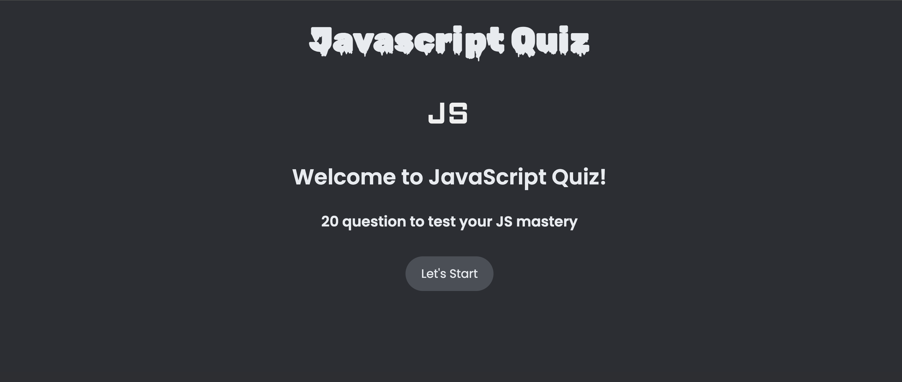
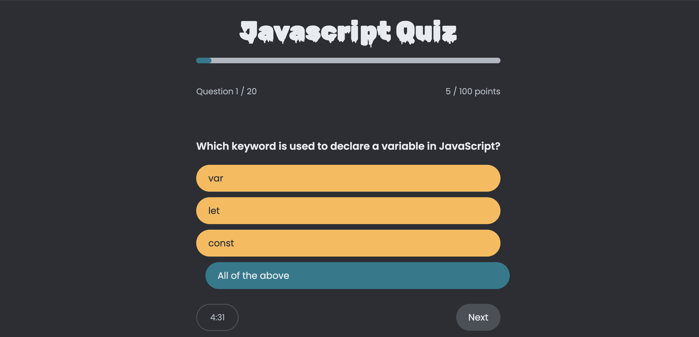
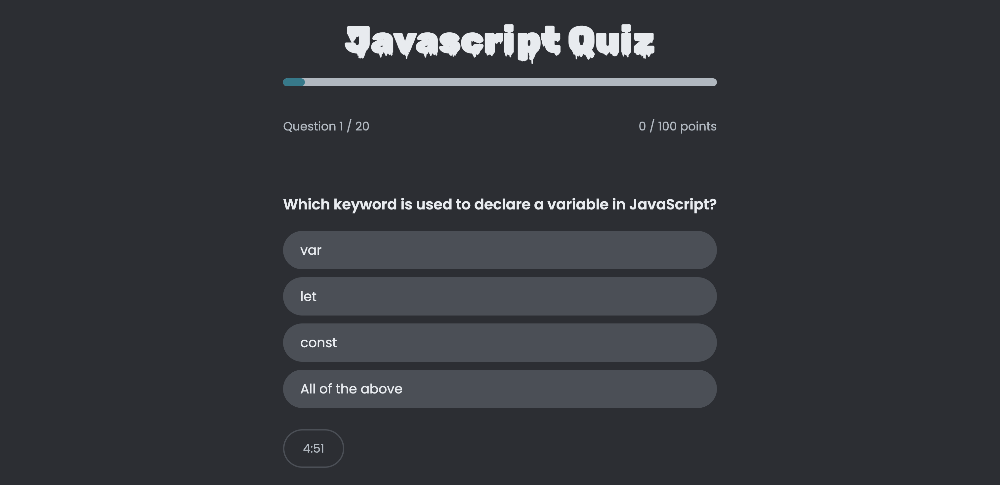
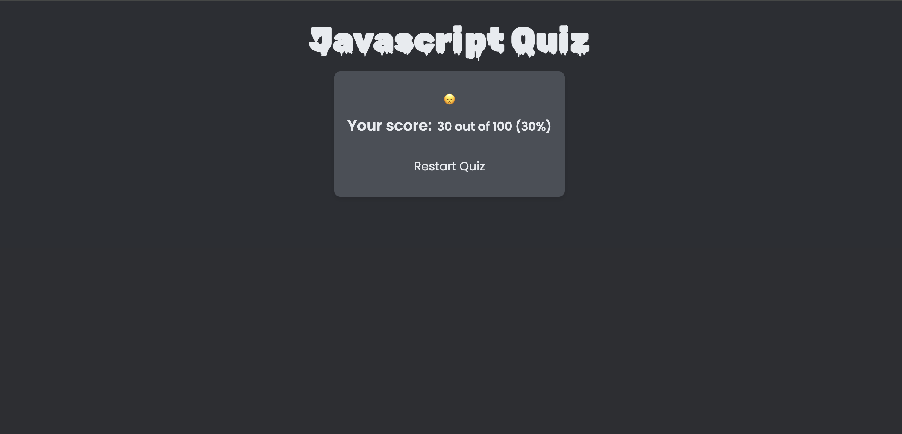

# JavaScript Quiz App

A React-based quiz application to test your JavaScript knowledge. This app features a start screen, a timed quiz, and a results screen to help you measure and improve your JavaScript skills.

## Features

- **Start Screen**: Welcome screen with quiz instructions
- **Timed Quiz**: 5-minute timer that automatically ends the quiz if time runs out
- **Results Screen**: Displays score and allows retake of the quiz
- **Responsive Design**: Fully responsive for both desktop and mobile

## Screenshots

Here are some screenshots of the application:






## Getting Started

### Prerequisites

- Node.js and npm installed

### Installation

1. **Clone the repository**:
   ```bash
   git clone https://github.com/your-username/my-quiz.git
   ```
2. **Navigate to the project directory**:
   ```bash
   cd my-quiz
   ```
3. **Install dependencies**:

   ```bash
   npm install

   ```

4. **Start the development server**:

   ```bash

   npm start
   ```

The app should now be running on `http://localhost:3000`.

## Usage

1. Click **Start** to begin the quiz.
2. Answer the questions before the timer runs out.
3. View your score on the results screen, and click **Restart Quiz** if you’d like to try again.

## Technologies Used

- **React** for UI components
- **CSS Modules** for styling
- **JavaScript** for interactivity

## Author

Developed by [Abdullah Alioğlu](https://github.com/AbdllhAlioglu)

---

Enjoy testing and improving your JavaScript knowledge!
